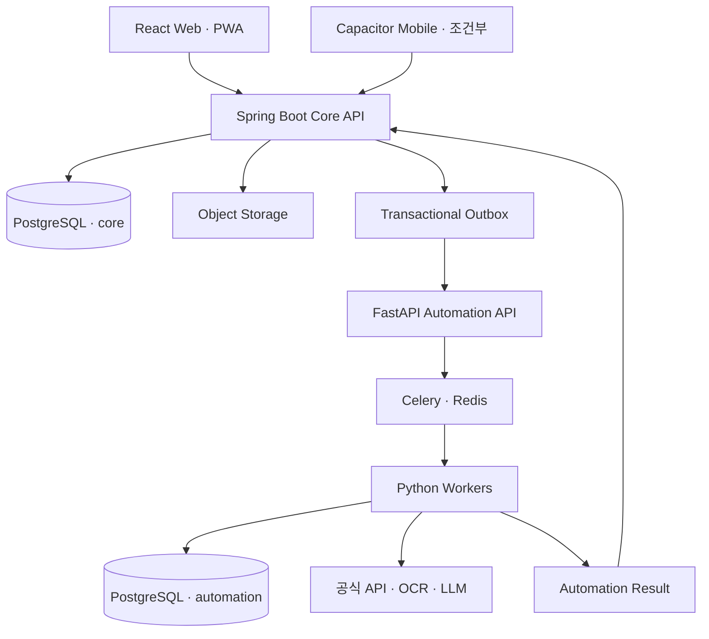

# 프로젝트 기술 스택 및 아키텍처 기준

> 문서 상태: 기술 기준 문서
> 기준일: 2026-09-15
> 적용 범위: Product Research Platform, SourcePilot, Import Keyword Discovery, TradeGuard Ops
> 목적: 상품화 가능한 무역 운영 ERP를 기본 경로로 유지하면서 개인용 운영 도구로도 축소 가능한 기술·구조 기준을 고정한다.

---

## 1. 문서 역할

이 문서는 프로젝트의 기술 선택과 서비스 경계를 결정하는 기준 문서다.

### 현재 구현 기준선

[ADR-0002](../architecture/ADR-0002-core-domain-and-clean-baseline.md)에 따라 현재 실행 구성은
`React → Spring Boot → PostgreSQL`이다. Research Python 서버, Celery, Redis, 자동화·staging
스키마는 퇴역 또는 조건부 설계이며 현재 구성 요소가 아니다. Flyway는 기본 PostgreSQL 스키마에
V1(인증·조직·화물·협업), V2(Product·BusinessPartner·SupplierQuote), V3~V6(원가·발주·입고·판매),
V7(수동 공급 제안 접수), V8(구매 품목 선택), V9(다품목 발주)을 순방향으로 설치한다.

이 문서 아래의 Worker, Redis, Outbox, 다중 논리 스키마 설명은 자동화가 실제로 다시 선택될 때의
목표 계약이다. 현재 상태로 읽거나 테이블을 미리 만들 근거로 사용하지 않는다.

- PRD는 제품 요구사항과 업무 흐름을 정의한다.
- 이 문서는 런타임, 데이터 소유권, 통신 계약, 배포 및 품질 기준을 정의한다.
- PRD와 이 문서가 충돌하면 기술 구현에서는 이 문서를 우선하고, 필요한 경우 ADR로 변경 이유를 기록한다.
- 라이브러리의 세부 패치 버전은 잠금 파일과 빌드 파일에서 관리한다.

### 상태 표기

| 상태 | 의미 |
|---|---|
| 현재 | 기존 코드에 적용되어 있음 |
| 목표 | 신규 기능의 기본 선택이며 점진적으로 전환함 |
| 조건부 | 실제 데이터량이나 요구가 발생할 때 도입함 |
| 보류 | 현재 범위에서는 도입하지 않음 |

---

## 2. 핵심 아키텍처 결정

### 2.1 기본 형태

프로젝트는 마이크로서비스가 아닌 **모듈러 코어 API + 자동화 워커** 구조를 사용한다.



### 2.2 변경하지 않는 원칙

1. Spring Boot가 업무 상태와 최종 데이터를 소유한다.
2. Python은 수집, OCR, LLM, 임베딩, 군집화 등 자동화 작업을 담당한다.
3. Python은 `core` 스키마를 직접 수정하지 않는다.
4. PostgreSQL을 시스템 오브 레코드로 사용한다.
5. 외부 API와 LLM 공급자는 어댑터 또는 Gateway 뒤에 격리한다.
6. 비동기 작업은 멱등성, 재시도, 취소, 실패 격리와 추적 ID를 지원한다.
7. 상품화 가능성을 위해 조직 경계와 감사 이력을 처음부터 유지한다.
8. 모바일은 별도 제품이 아니라 동일 API와 업무 계약을 사용하는 클라이언트다.
9. 브라우저와 모바일 클라이언트는 Spring Core API만 호출하며 FastAPI·Celery에 직접 접근하지 않는다.
10. 캐시, 큐, Worker 실행 기록은 업무 원장을 대신하지 않는다.

---

## 3. 기술 스택

### 3.1 프론트엔드

| 항목 | 선택 | 상태 | 비고 |
|---|---|---|---|
| UI | React 19 | 현재 | 기존 화면 재사용 |
| 언어 | TypeScript | 목표 | 기존 JavaScript는 점진 전환 |
| 빌드 | Vite | 목표 | `react-scripts`에서 이전 |
| 라우팅 | React Router | 목표 | URL 기반 화면·딥링크 |
| 서버 상태 | TanStack Query | 목표 | 캐시, 재시도, 작업 상태 조회 |
| 스타일 | 기존 CSS + 디자인 토큰 | 목표 | UI 프레임워크 강제 도입 안 함 |
| API 클라이언트 | OpenAPI 생성 TypeScript Client | 목표 | 수기 URL·응답 타입 최소화 |
| 설치형 웹 | PWA | 목표 | 데스크톱·모바일 설치 지원 |
| 네이티브 포장 | Capacitor | 조건부 | 카메라·파일·푸시 요구 시 도입 |
| 네이티브 전용 앱 | React Native + Expo | 보류 | 강한 네이티브 요구가 확인될 때 검토 |

프론트엔드는 다음 계층을 구분한다.

```text
frontend/src/
├── app/              # 라우팅·부트스트랩
├── modules/          # 업무 모듈별 화면과 유스케이스
├── api/generated/    # OpenAPI 생성 클라이언트
├── domain/           # 타입·상태·표시 규칙
├── design-system/    # 공통 컴포넌트·토큰
└── platform/         # 카메라·파일·알림·네트워크 추상화
```

### 3.2 코어 백엔드

| 항목 | 선택 | 상태 | 비고 |
|---|---|---|---|
| 언어 | Java 17 이상 | 현재 | 메이저 업그레이드와 별개로 유지 가능 |
| 프레임워크 | Spring Boot 4.1.x | 목표 | 현재 3.4.x에서 호환성 검증 후 이전 |
| 구조 | Spring Modulith | 목표 | 하나의 배포 단위에서 도메인 경계 검증 |
| API | REST + OpenAPI | 현재/목표 | `/api/v1` 계약 유지 |
| 데이터 접근 | Spring Data JPA | 현재 | 코어 업무 데이터 전용 |
| 인증·인가 | Spring Security | 현재 | 조직 단위 권한 적용 |
| 마이그레이션 | Flyway | 현재 | Spring 소유 스키마의 DDL 책임자 |
| 상태 확인 | Actuator·Micrometer | 현재/목표 | 헬스·메트릭·추적 |
| 테스트 | JUnit·Spring Test·Testcontainers | 현재 | 빈 PostgreSQL 설치와 조직 격리 통합 테스트 적용 |

권장 도메인 모듈은 다음과 같다.

```text
identity       사용자·조직·외부 참여자
catalog        단일 Product 생명주기, 필요 시 Variant
discovery      키워드·시장 신호
sourcing       공급 견적·견적 행·샘플
tradecase      후보부터 입고까지 장기 프로세스 조정
procurement    PO·송금 상태·생산 일정
logistics      선적·B/L·Package·통관
inventory      입고 Lot·재고·이동
costing        환율·관세·운임·실원가
documents      문서·버전·추출 결과
attention      Task·Alert·Approval
automation     작업 요청·결과 반영
integration    외부 API·동기화 상태
audit          변경 이력·근거
```

`tradecase`는 다른 모듈의 Aggregate를 소유하지 않는다. 각 모듈의 ID와 공개 상태만 참조하며, 후보 → PO → 선적 → 입고로 이어지는 장기 프로세스의 다음 단계와 차단 사유를 조정하는 Process Manager 역할만 맡는다.

#### 모듈 의존 규칙

- 각 모듈은 `api`, `application`, `domain`, `infrastructure` 책임을 구분한다.
- Controller는 Application Service만 호출하고 Repository를 직접 호출하지 않는다.
- Domain 계층은 Spring, JPA, HTTP, Redis, Provider SDK를 의존하지 않는다.
- 외부 시스템은 Application 계층의 Port 인터페이스 뒤에 둔다.
- 다른 모듈의 Repository·Entity·internal package를 직접 참조하지 않는다.
- 동기 호출은 상대 모듈의 공개 Application API만 사용한다.
- 후속 작업, 알림, 감사, 읽기 모델 갱신은 도메인 이벤트로 분리한다.
- `attention`과 `audit`는 업무 모듈이 직접 호출하는 범용 유틸리티가 아니라 이벤트 소비자로 동작한다.
- `global`, `common`, `util` 패키지에는 업무 로직을 넣지 않는다.
- 인터페이스는 실제 교체 지점이나 테스트 경계에만 만들고, 구현체마다 기계적으로 생성하지 않는다.

이 규칙은 SRP, DIP와 Interface Segregation을 지키되 불필요한 추상화를 늘리지 않기 위한 기준이다.

### 3.3 자동화·AI

| 항목 | 선택 | 상태 | 비고 |
|---|---|---|---|
| 언어 | Python | 조건부 | 반복 자동화 요구가 측정될 때 데이터·ML 작업에 사용 |
| 내부 API | FastAPI | 조건부 | 도입 시 외부 공개 없이 `/internal/v1` 계약만 제공 |
| 작업 큐 | Celery | 조건부 | 단순 동기 작업으로 감당할 수 없을 때 검토 |
| 브로커·캐시 | Redis | 조건부 | 영구 업무 원장으로 사용 금지 |
| ORM | SQLAlchemy | 조건부 | 도입 시 `automation`·`staging` 전용 |
| 마이그레이션 | Alembic | 조건부 | Python 소유 스키마가 생길 때만 도입 |
| ML | 목적에 맞는 최소 라이브러리 | 조건부 | 실제 모델 작업과 함께 선택 |
| LLM | LLM Gateway | 조건부 | 공급자·모델을 코어 도메인에서 격리 |
| 구조화 출력 | JSON Schema 검증 | 조건부 | 실패 시 수동 입력 폴백 |

AI는 다음을 결정하지 않는다.

- 판매 성공 가능성의 확정
- 최종 HS Code·통관·법률 판단
- 가격·원가·점수의 결정론적 계산
- 발주·송금·외부 전송의 최종 승인

### 3.4 데이터·스토리지

| 항목 | 선택 | 상태 | 비고 |
|---|---|---|---|
| 관계형 DB | PostgreSQL 15 이상 | 현재 | 시스템 오브 레코드 |
| 가변 속성 | JSONB | 현재/목표 | 원본·스냅샷·카테고리 속성에 제한 |
| 벡터 검색 | pgvector | 조건부 | 데이터량·지연 측정 후 인덱스 도입 |
| 객체 저장소 | S3 호환 Object Storage | 목표 | 문서·이미지·견적 파일 |
| 캐시 | Redis | 조건부 | 현재 미사용, 도입 시 재생성 가능한 데이터만 저장 |

현재는 단일 애플리케이션과 기본 `public` 스키마를 사용한다. 서비스가 실제로 분리될 때만 다음
논리 스키마와 DB 역할 분리를 적용한다.

| 스키마 | 소유자 | 용도 |
|---|---|---|
| `core` | Spring | 업무 원장·최종 상태 |
| `automation` | Python | 작업 실행·중간·결과 데이터 |
| `staging` | Python | 외부 원본 임시 적재 |
| `integration` | Spring | 연결·동기화·커서·쿼터 |
| `reference` | Spring | HS·환율·규칙·코드 |
| `audit` | Spring | 변경·승인·외부 실행 이력 |

금액, 통화, 수량, 상태, 날짜, SKU, 재고, 환율, 승인 여부는 일반 컬럼으로 저장한다. JSONB는 외부 원본, 가변 속성, 계산 입력 스냅샷, OCR·LLM 결과 등에 제한한다.

### 3.5 조건부 자동화 저장 정책

AI 서버는 Redis 캐시만으로 운영하지 않는다. 큐와 캐시가 사라져도 작업을 복구하고 결과의 출처를 재현할 수 있도록 PostgreSQL과 Object Storage에 영속 데이터를 남긴다. 별도 물리 데이터베이스는 필요하지 않으며, 초기에는 코어와 같은 PostgreSQL 인스턴스의 논리 스키마를 사용한다.

| 저장소 | 저장 대상 | 보존 성격 |
|---|---|---|
| Redis | Celery 메시지, 짧은 진행률, 분산 락, 재생성 가능한 캐시 | 일시적·TTL 필수 |
| `core.automation_job` | 사용자가 보는 작업 상태, 멱등성 키, 최종 결과 참조 | 영속·Spring 소유 |
| `automation.automation_run` | Worker 실행, 시도 횟수, 모델·파이프라인 버전, 오류 | 영속·Python 소유 |
| `automation.automation_result` | 구조화 출력, 품질 점수, 경고, 결과 전달 상태 | 영속 후 보존 정책 적용 |
| `staging.provider_snapshot` | 외부 API·OCR·수집 원본과 정규화 전 데이터 | 임시 영속·만료시각 보유 |
| Object Storage | 문서, 이미지, 대형 원문, 대용량 모델 입출력 | 정책 기반 보존 |
| `core.ai_artifact` | 사용자에게 채택·노출된 최종 AI 산출물과 근거 | 영속·감사 대상 |

SQL의 `TEMP TABLE`은 Worker 간 공유와 장애 복구에 적합하지 않으므로 작업 원장으로 사용하지 않는다. 임시 데이터도 일반 테이블에 `expires_at`, `source_hash`, `job_id`를 두어 저장하고 보존 정책에 따라 정리한다.

권장 초기 보존 정책은 다음과 같으며 데이터 민감도와 제공자 약관에 따라 조정한다.

- Redis 진행률·캐시: 수분~24시간
- 작업 실행·오류 기록: 최소 90일
- 외부 원본 Staging: 30~90일
- 채택된 AI 산출물·계산 근거: 관련 업무 데이터의 보존기간과 동일
- 문서 원본: 사용자 삭제·법적 보존 정책에 따름

Object Storage도 작성 경계를 분리한다.

- Spring: `documents/`의 사용자 원본과 최종 문서 메타데이터를 소유한다.
- Python: `automation/`의 파생 파일과 임시 산출물을 작성한다.
- Python은 Spring이 발급한 제한된 업로드 URL 또는 전용 Prefix 권한만 사용한다.
- 파생 파일을 최종 업무 문서로 채택할 때 Spring이 검증 후 `core` 메타데이터에 등록한다.
- DB에는 Storage Key, 해시, MIME Type, 크기, 보존등급을 저장하고 공개 URL을 영구 저장하지 않는다.

---

## 4. 데이터 소유권과 통신 규칙

### 4.1 단일 작성자 원칙

- Spring만 `core`, `integration`, `reference`, `audit`를 수정한다.
- Python은 `automation`, `staging`만 수정한다.
- Python 결과가 업무 상태를 변경하려면 Spring API 또는 버전된 결과 이벤트를 거친다.
- JPA Entity와 SQLAlchemy Model을 동일 업무 테이블에 중복 정의하지 않는다.
- Spring과 Python은 상대 서비스 소유 스키마를 애플리케이션 쿼리로 직접 읽지 않는다.
- Spring Flyway는 `core`, `integration`, `reference`, `audit`의 DDL만 관리한다.
- Python Alembic은 `automation`, `staging`의 DDL만 관리한다.
- 플랫폼 초기화 Migration은 스키마, DB Role, 공통 Extension만 생성하고 업무 테이블을 만들지 않는다.
- Migration Role과 런타임 Role을 분리하며, Spring·Python 런타임 계정은 자신의 스키마에 대한 DML 권한만 가진다.
- 한 서비스의 Migration에서 다른 서비스 소유 스키마를 변경하지 않는다.
- DB 권한으로 Python의 `core` 쓰기와 Spring의 `automation` 쓰기를 차단한다.

### 4.2 작업 요청 흐름

```text
사용자 요청
  → Spring 업무 트랜잭션
  → core.automation_job + outbox 기록
  → Spring Dispatcher가 FastAPI 내부 작업 API에 전달
  → Python이 automation.automation_run 생성
  → FastAPI가 Celery에 실행 요청
  → Worker가 staging 원본과 automation 결과 저장
  → Python Result Publisher가 Spring Callback API를 호출
  → Spring이 계약·조직·작업 상태·결과를 검증
  → core.ai_artifact와 코어 상태 반영
  → 사용자 알림·감사 기록
```

Spring은 Redis나 Celery 프로토콜을 알지 않는다. FastAPI는 Spring 업무 API나 `core` 테이블을 알지 않으며, 오직 작업 요청 계약과 결과 Callback 계약만 안다.

작업 접수와 결과 반영 API의 호스트를 다음과 같이 고정한다.

| 호스트 | Endpoint | 호출자 | 책임 |
|---|---|---|---|
| FastAPI | `POST /internal/v1/jobs` | Spring Dispatcher | 작업 접수·중복 차단·Celery 등록 |
| FastAPI | `POST /internal/v1/jobs/{jobId}/cancel` | Spring Dispatcher | 취소 요청 접수 |
| Spring | `POST /internal/v1/automation/jobs/{jobId}/progress` | Python Result Publisher | 진행률·실행 요약 투영 |
| Spring | `POST /internal/v1/automation/jobs/{jobId}/result` | Python Result Publisher | 최종 결과 검증·반영 |

- 내부 API는 서비스 인증을 적용하고 외부 Gateway에 노출하지 않는다.
- 동일 `jobId`와 `idempotencyKey`의 재전달은 새 실행을 중복 생성하지 않는다.
- 결과 Callback은 최소 한 번 전달될 수 있으므로 Spring이 중복 반영을 차단한다.
- Callback은 `sequence`를 포함하고 Spring은 마지막 처리 Sequence 이하의 지연 메시지를 무시한다.
- Spring이 FastAPI 접수 응답을 받지 못해도 Outbox 이벤트를 삭제하지 않고 재전달한다.
- Celery와 Redis의 장애는 Spring 업무 트랜잭션을 롤백시키지 않는다.
- 작은 결과는 Callback Body에 포함하고, 큰 결과는 제한된 Object Storage Key와 해시로 전달한다. Spring은 Python DB의 Result ID를 직접 조회하지 않는다.

### 4.3 공통 작업 상태

```text
QUEUED
RUNNING
SUCCEEDED
SUCCEEDED_WITH_WARNINGS
FAILED_RETRYABLE
FAILED_FINAL
CANCEL_REQUESTED
CANCELLED
```

Spring이 소유하는 `core.automation_job`은 사용자에게 보이는 업무 작업의 단일 원장이다. 최소한 다음 필드를 가진다.

```text
id, organization_id, job_type, status, idempotency_key,
input_reference, input_contract_version, input_hash,
output_reference, output_contract_version,
progress_total, progress_completed, reported_attempt_count,
requested_at, accepted_at, started_at, completed_at,
trace_id, error_code, error_summary, version
```

Python이 소유하는 `automation.automation_run`은 Worker 실행의 단일 원장이다. `job_id`를 외래 참조가 아닌 계약 ID로 보관하고, `worker`, `attempt_no`, `provider`, `model`, `prompt_version`, `pipeline_version`, `started_at`, `heartbeat_at`, `completed_at`, `error_detail`, `result_id`를 기록한다.

- Spring은 Callback으로 받은 요약만 `core.automation_job`에 투영한다.
- Python은 `core.automation_job.status`를 직접 변경하지 않는다.
- `CANCEL_REQUESTED`는 Spring의 요청 상태이며 Python이 실제 실행 종료를 확인한 뒤에만 `CANCELLED`로 전환한다.
- 완료·실패·취소 같은 Terminal 상태 이후에는 더 오래된 진행률 Callback으로 상태를 되돌리지 않는다.
- `input_reference`는 코어 Aggregate ID와 요청 목적을 담고, 외부 API 원본은 담지 않는다.
- 원본과 중간 데이터는 `staging`, 상세 실행 정보는 `automation`에만 저장한다.
- 두 서비스는 같은 테이블을 공동 수정하지 않는다.

내부 Spring 모듈 이벤트에는 Spring Modulith Event Publication Registry를 사용하고, Python으로 나가는 명령에는 별도 Transactional Outbox를 사용한다. 둘을 같은 용어 또는 같은 테이블로 취급하지 않는다.

---

## 5. 멀티테넌시와 감사

개인용 전환 가능성과 관계없이 상품화 경로를 위해 조직 경계를 유지한다.

- 모든 테넌트 소유 Aggregate Root와 외부에서 ID로 조회 가능한 자식 테이블은 `organization_id`를 직접 가진다.
- 전역 HS 코드, 국가 코드처럼 모든 조직이 공유하는 불변 Reference만 조직 ID를 갖지 않는다.
- 외부 ID, 문서번호, 멱등성 키의 유일 제약은 조직 ID를 포함한다.
- 조직 ID는 요청 Body의 값을 신뢰하지 않고 인증 컨텍스트에서 결정한다.
- Repository와 서비스 계층에서 현재 조직 조건을 누락하지 않는다.
- 조직 컨텍스트 없이 테넌트 Repository를 호출할 수 없도록 Application Service 계약을 설계한다.
- 테넌트 테이블은 `(organization_id, id)` 또는 업무 키에 맞는 복합 인덱스를 가진다.
- 다른 조직의 ID를 알고 있어도 조회·수정할 수 없는 통합 테스트를 둔다.
- 지원·관리자 접근도 사유와 함께 감사 로그에 남긴다.
- 견적, 환율, PO, Invoice, 문서, 계산식, 승인, AI 결과는 당시 스냅샷과 버전을 보존한다.

---

## 6. API·이벤트 계약

### 6.1 REST API

- API 버전은 `/api/v1`을 사용한다.
- 프론트엔드·모바일은 Spring Core API만 호출한다.
- FastAPI는 `/internal/v1` 자동화 계약만 제공하며 브라우저 CORS를 허용하지 않는다.
- JPA Entity를 API 응답으로 직접 반환하지 않는다.
- OpenAPI에서 프론트엔드 타입과 클라이언트를 생성한다.
- 오류는 HTTP 상태와 안정적인 업무 오류 코드를 함께 반환한다.
- 금액은 값과 통화를 분리하고 `float`를 사용하지 않는다.
- 외부 실행 요청은 `Idempotency-Key`를 지원한다.

### 6.2 이벤트

모듈 밖으로 전달되거나 영속 저장되는 이벤트는 다음 Envelope를 따른다. Aggregate 내부의 단순 메서드 호출까지 이벤트로 바꾸지 않는다.

```json
{
  "event_type": "PURCHASE_ORDER_CONFIRMED",
  "schema_version": 1,
  "event_id": "uuid",
  "organization_id": "uuid",
  "aggregate_id": "uuid",
  "occurred_at": "2026-09-01T12:00:00+09:00",
  "trace_id": "uuid",
  "payload": {}
}
```

- 이벤트 타입과 필드 의미를 변경하지 않고 새 버전을 추가한다.
- 소비자는 중복 이벤트를 안전하게 무시할 수 있어야 한다.
- 이벤트 Payload는 상대 모듈 Entity가 아니라 안정적인 ID, 값 객체와 필요한 스냅샷만 포함한다.
- 동기 응답이 필요한 검증을 비동기 이벤트로 우회하지 않는다.
- 외부 메시지 브로커는 실제 처리량과 서비스 분리 필요가 확인될 때 도입한다.

---

## 7. 웹·모바일 전략

### 7.1 단계적 접근

1. React 화면을 Vite·TypeScript 기반 반응형 웹으로 전환한다.
2. PWA Manifest, 설치, 오프라인 안내와 제한적 캐시를 적용한다.
3. 모바일 전용 승인·촬영·입고·알림 화면을 제공한다.
4. 네이티브 카메라·푸시·파일 기능이 필요하면 Capacitor로 포장한다.
5. 장시간 백그라운드 실행, Bluetooth·NFC·전문 스캐너가 필요할 때만 Expo를 검토한다.

### 7.2 오프라인 범위

오프라인에서는 현장 입력만 임시 저장한다.

- 사진·문서 촬영
- 바코드·수량 입력
- 메모
- 승인 보류 응답

PO 발행, 원가 확정, 재고 차감, 송금 및 법적 판단은 온라인 상태에서 서버가 처리한다. 오프라인 입력은 클라이언트가 생성한 `command_id`와 `idempotency_key`를 가진 Capture Queue로만 동기화하며, 서버 승인 전에는 ERP 상태로 표시하지 않는다.

---

## 8. 외부 연동 원칙

- 공식 API와 사용자가 권한을 가진 데이터만 사용한다.
- Provider 인터페이스로 인증, 호출, 정책, 쿼터, 캐시 규칙을 격리한다.
- 원본 응답과 수집 시각을 보존하고 정규화 결과와 분리한다.
- 외부 장애는 전체 실행 실패가 아니라 가능한 경우 부분 성공으로 처리한다.
- API 키는 Secret Manager 또는 운영 환경의 비밀 저장소에 보관한다.
- Spring은 연결 설정과 Secret Reference를 소유하고, Python에는 작업에 필요한 최소 Secret 또는 단기 자격만 전달한다.
- Python은 Provider 실행 횟수·비용·쿼터 사용량을 결과 Callback으로 보고하고, Spring이 `integration` 상태에 반영한다.
- 인증 헤더, API Key, 공급처 연락처와 문서 원문을 일반 로그에 남기지 않는다.
- CSV·URL·수동 입력을 핵심 폴백 경로로 유지한다.

---

## 9. 배포·운영

### 9.1 개발 환경

- Docker Compose
- PostgreSQL
- Spring Core API
- React 개발 서버

### 9.2 운영 환경

| 구성 | 기본 선택 |
|---|---|
| Web | 정적 호스팅 또는 CDN |
| Core API | 관리형 컨테이너 런타임 |
| Automation | 조건 충족 시 별도 내부 컨테이너·Worker |
| Database | 관리형 PostgreSQL |
| Queue·Cache | 자동화 도입 시 관리형 Redis 검토 |
| Files | S3 호환 Object Storage |
| Secrets | 플랫폼 Secret Manager |

초기 범위에서는 Kubernetes, Kafka, 서비스별 독립 DB를 도입하지 않는다.

### 9.3 관측성

모든 요청과 작업에 공통 `trace_id`를 전달한다.

- Core API 요청률·오류율·지연
- 외부 API 성공률·429·5xx·timeout
- Celery 대기시간·실행시간·재시도·최종 실패
- LLM 모델·토큰·비용·JSON 검증 실패
- 데이터 신선도·마지막 성공 시각
- 출처 없는 AI 수치 결과
- 업무 이벤트와 사용자 승인 이력

---

## 10. 테스트 기준

- 계산식과 상태 전이는 결정론적 단위 테스트를 둔다.
- 조직 간 데이터 접근 차단 통합 테스트를 둔다.
- PostgreSQL은 Testcontainers 기반 통합 테스트를 우선한다.
- 외부 Provider는 fixture와 contract test를 둔다.
- 비동기 작업을 도입하면 중복 실행, 재시도, timeout, 취소, 부분 성공을 테스트한다.
- 자동화 서비스를 도입하면 Spring 요청과 Worker Callback에 양방향 contract test를 둔다.
- 런타임 DB 계정이 다른 서비스 스키마에 쓸 수 없는지 권한 테스트를 둔다.
- Spring Modulith `ApplicationModules.verify()`로 금지된 모듈 의존을 검사한다.
- OpenAPI 변경은 하위 호환성 검사를 통과해야 한다.
- 임베딩·규칙·프롬프트 변경은 버전된 골든셋으로 회귀 테스트한다.

---

## 11. 현재 도입하지 않는 기술

명확한 요구와 측정 근거가 생기기 전에는 다음을 도입하지 않는다.

- Kubernetes
- Kafka 또는 별도 이벤트 스트리밍 플랫폼
- 별도 벡터 데이터베이스
- 서비스별 독립 데이터베이스
- GraphQL
- 자체 범용 워크플로 엔진
- 프론트엔드와 별개의 모바일 앱 동시 개발
- 여러 LLM 공급자의 동시 구현

---

## 12. 전환 우선순위

### P0 — 코어 기준선 (완료)

- [x] Python의 코어 업무 테이블 직접 쓰기와 브라우저 직접 호출 제거
- [x] 사용하지 않는 Research·AI·Celery·Redis 런타임 제거
- [x] 빈 DB용 V1/V2 Flyway 기준선 적용
- [x] Product 단일 생명주기와 BusinessPartner 역할 모델 적용
- [x] Product → SupplierQuote 조직 경계 통합 테스트 추가

자동화가 없는 현재 단계에는 `automation_job`, Outbox, Python Alembic을 만들지 않는다.

### P1 — 기술 현대화

- [ ] Spring Boot 4.1.x 호환성 검증 및 이전
- [ ] `react-scripts`에서 Vite로 이전
- [ ] TypeScript 점진 전환
- [ ] OpenAPI 기반 프론트엔드 클라이언트 생성
- [ ] Object Storage와 문서 메타데이터 분리
- [ ] 서비스 간 `trace_id` 전파

### P2 — 앱 준비

- [ ] PWA Manifest·설치·오프라인 안내
- [ ] 모바일 승인·촬영·입고 UX
- [ ] 오프라인 Capture Queue와 멱등 업로드
- [ ] Capacitor 적용 여부 검증

### P3 — 사용량 기반 확장

- [ ] pgvector exact search 도입 검토
- [ ] 데이터량·지연 측정 후 HNSW 인덱스 검토
- [ ] 외부 메시지 브로커 필요성 재평가
- [ ] 서비스·DB 물리 분리 필요성 재평가

---

## 13. 현재 구현 감사 결과

2026-09-15 기준 P0의 데이터 소유권 중복과 브라우저 FastAPI 직접 호출은 제거됐다. 현재 가장 큰
제품 공백은 견적 API를 사용할 화면과 견적 간 비교 규칙이다. 그 다음은 예상 원가
`CostScenario`이며, PO·입고·재고는 실제 선행 흐름이 확인된 뒤 추가한다.

프론트엔드는 아직 JavaScript와 `react-scripts` 기반이다. 상품·견적 사용자 흐름을 먼저 완성한 뒤
Vite·TypeScript 전환을 별도 기계적 변경으로 수행한다.

### P1 — 운영 비밀정보 기본값

Docker Compose의 개발용 JWT Secret 기본값은 로컬 프로필에만 허용한다. 운영 환경에서는 Secret이 없으면 Spring이 시작에 실패해야 하며, 기본값으로 실행되어서는 안 된다.

### P1 — 하드코딩된 업무 데이터

프론트엔드의 가짜 트렌드 키워드와 데모 데이터는 운영 코드에서 분리한다. 데모 Fixture는 명시적인 Demo Profile에서만 활성화하고, 운영 화면은 Provider 결과 또는 사용자 프로젝트 데이터만 사용한다.

---

## 14. 변경 절차

다음 변경은 ADR을 작성한 후 반영한다.

- 핵심 프레임워크 또는 언어 변경
- 데이터 소유자 변경
- 신규 영구 저장소 도입
- 신규 메시지 브로커 도입
- 서비스 또는 DB 물리 분리
- 인증·테넌트 모델 변경
- 모바일 구현 전략 변경

ADR에는 문제, 선택지, 결정, 장단점, 마이그레이션과 롤백 방법을 기록한다.

---

## 15. 관련 문서와 현재 구현

- [TradeGuard Ops PRD](./prd.md)
- [수입·국내 소싱·국내 판매 통합 로드맵 v2](./import-domestic-platform-roadmap-v2.md)
- [국내 판매 상품 검증 모듈 실행 계획 v1](./domestic-product-validation-module-v1.md)
- [가입 승인 및 참여 권한 설계 v1](./identity-access-approval-design-v1.md)
- [P0 서비스·데이터 소유권 ADR](../architecture/ADR-0001-p0-service-and-data-ownership.md)
- 기존 구현: 저장소 루트

현재 구현의 주요 기준 파일:

```text
frontend/package.json
api-server/build.gradle.kts
api-server/src/main/resources/application.yml
api-server/src/main/resources/db/migration/
docker-compose.yml
```
