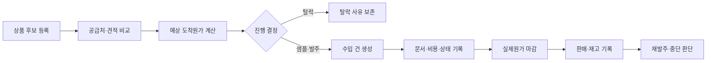
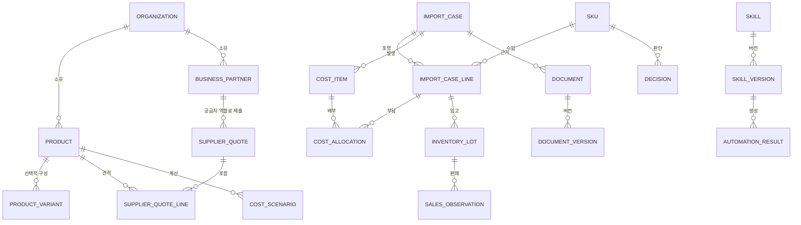
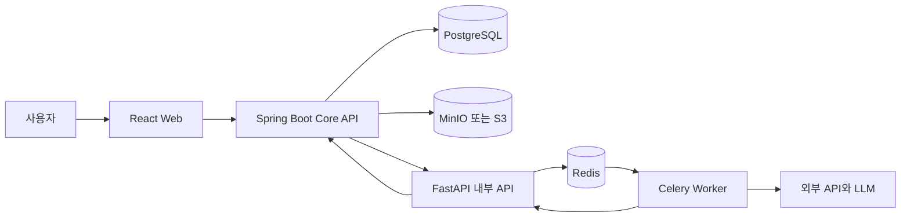
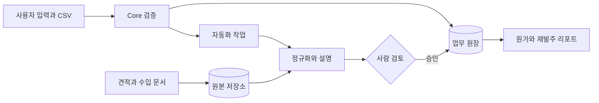
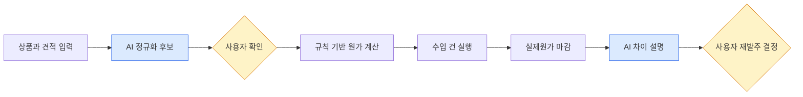
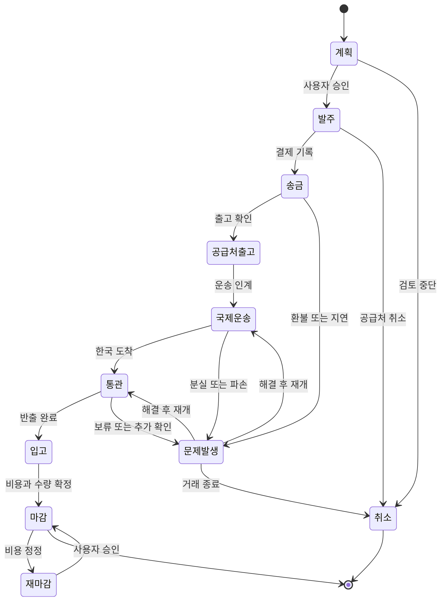
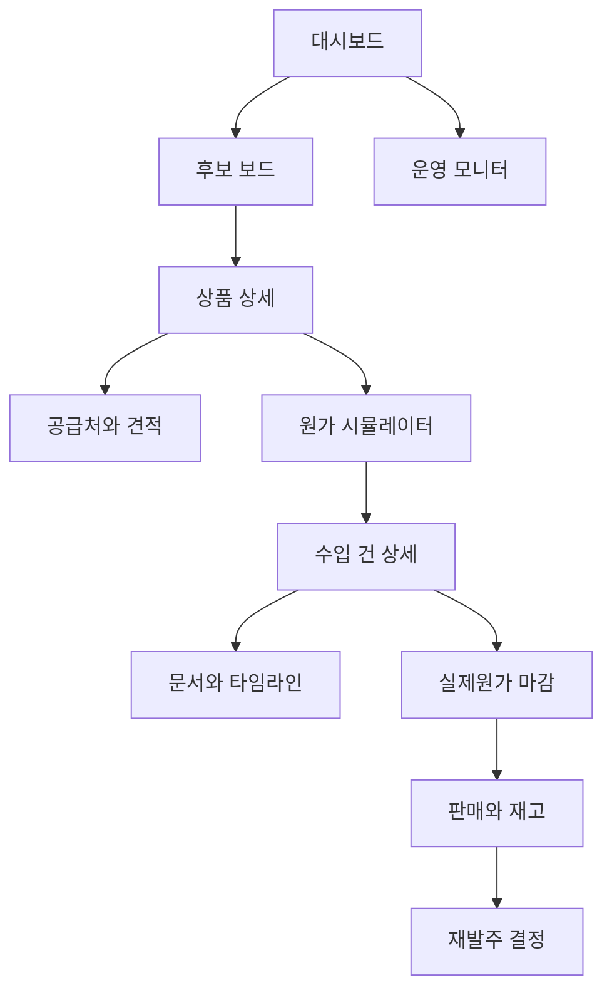

# PRD — Import OS V0

> 버전: v0.1
> 상태: 개발 기준
> 작성일: 2026-09-12
> 개발 기간 가정: 4주
> 첫 사용자: 창업자 본인
> 분량: 약 30페이지(공백 포함 27,000자 이상, 최종 파일 기준)

이 문서는 발표용 기능 목록이 아니라 실제 개발·운영·검증의 단일 기준이다. 구현 중 새로운 기능이 필요해 보이면 즉시 추가하지 않고, 현재 핵심 가설과 3-SKU 검증에 필요한지 먼저 판정한다. 범위 변경은 결정 이유와 검증 지표를 함께 기록한다.

## 한 줄 정의

일본 상품을 5~30개 단위로 시험 수입하는 한국 1인 온라인 셀러가, 공급처 견적부터 예상 도착원가·수입 문서·실제 원가·판매성과·재발주 판단을 한 SKU 흐름으로 관리하는 웹 기반 수입 운영 OS다.

## 30초 요약

- **문제:** 소형 수입의 상품 링크, 견적, 환율, 운임, 관부가세, 문서와 판매결과가 Excel·폴더·메신저에 흩어져 수입 전 가정과 실제 손익이 연결되지 않는다.
- **해결:** 상품 후보와 수입 건을 연결하고 예상비용과 실제비용을 같은 항목으로 마감한 뒤 판매·재고 결과를 다음 발주 판단으로 되돌린다.
- **대상:** 일본 비전기 생활·수납·문구·취미용품을 국내 온라인 마켓에서 시험 판매하려는 한국 1인 사업자.
- **핵심 차별점:** 상품 추천이나 단순 원가계산이 아니라 `예상원가 → 실제원가 → 실현마진 → 재발주`의 닫힌 데이터 루프를 만든다.
- **형태:** Docker Compose 기반 웹앱. V0부터 인증된 `Organization`을 업무 소유 경계로 사용한다.

## IR Deck 전환 준비

이 PRD는 투자자료가 아니라 투자자료의 사실 원천이다. 지원사업 5축 예비 매칭은 완료했지만 사업자 상태·업력·소재지·수혜 이력이 미확인되어 특정 트랙과 투자 Ask는 아직 확정하지 않는다.

BM 확정 전 증거 수집과 가격 실험 순서는 [BM Stage 1 — Market to BM Bridge](./bm-stage-1-market-to-bm.md)를 따른다.

시장 정의, 공식 사실, 2주 조사와 SOM 산식은 [시장조사 Stage 1](./market-stage-1.md)을 따른다. L2 인터뷰와 L3 교차검증 전까지 TAM·SAM·SOM 금액을 확정하지 않는다.

정부지원사업 후보, 5축 채점, 예산 비목과 IR 반영 규칙은 [지원사업 매칭 Stage 1](./program-stage-1.md)을 따른다. 현재 조건부 1순위는 일반 사업화형이며, R&D·AI 바우처·수출 트랙은 현 단계에서 주력하지 않는다.

### IR 사실·가설 대장

| ID | 내용 | 등급 | PRD 사용 원칙 |
|---|---|---|---|
| F-001 | 창업자는 T/T 송금, 회계처리, 통관·입고, 포워더·관세사 협업과 납품 업무 경험이 있다. | 사용자 제공 사실 | 팀·Founder-Market Fit의 근거. 기간·건수는 미확인 |
| F-002 | V0 첫 회랑은 일본에서 한국으로 들어오는 소량 수입이다. | 제품 결정 | 전체 시장규모 주장에 사용하지 않음 |
| F-003 | 첫 사용자는 창업자 본인이며 실제 3-SKU로 검증한다. | 검증 계획 | 트랙션으로 표현 금지 |
| F-004 | 제품은 단일 사용자에서 시작하지만 모든 핵심 데이터에 Organization 경계를 둔다. | 설계 결정 | 현재 조직·직원·건별 외부 권한은 구현됨 |
| F-005 | 엔화 약세는 초기 테스트 비용을 낮출 수 있다. | 외부환경 가설 | 특정 환율·지속기간 확인 전 영구 성장동력으로 표현 금지 |
| F-006 | 향후 소형 수입사업자 SaaS와 검증 SKU 공동사입으로 확장한다. | 로드맵 가설 | 고객수요 확인 전 매출원으로 산입 금지 |
| F-007 | 해외에는 MOQBuy·MOQ Pools·Collective Power 등 공동발주 서비스가 있다. | 공식 사이트 확인 | 세계 최초 주장 금지 |
| F-008 | 공개 조사상 한국에서 동일한 전체 조합의 강자는 확인되지 않았다. | 조사 결과 | “경쟁사 없음” 대신 “공개 완성형 미확인”으로 표현 |

`등급`은 IR 전용 팩트북에서 A(공식 1차), B(기업 공식), C(검증 전 가설), U(미확인)로 다시 관리한다.

### 자금 트랙 미확인 게이트

| 입력 | 현재 상태 | 확정 전 금지 사항 |
|---|---|---|
| 사업자·법인 설립일 및 업력 | 미확인 | 예비/초기창업 트랙 단정 |
| 최근 12개월 매출 | 미확인 | 트랙션·성장률 기재 |
| 누적 투자와 투자자 | 미확인 | 팁스·VC 우선순위 결정 |
| 상근 인력과 대표 경력 기간 | 일부만 확인 | 팀 역량 수치화 |
| 특허·출원·TRL | 미확인 | 기술 해자 주장 |
| 소재지와 지원제외 사유 | 미확인 | 정부 공고 적격 판단 |
| 잔여 런웨이와 투입 가능시간 | 미확인 | Ask와 개발기간 확정 |

### 12장 IR Deck으로 파생할 요소

| 장표 | 이 PRD에서 가져갈 내용 | 추가로 필요한 증거 |
|---|---|---|
| 01 한 문장 | 일본 소량수입 1인 셀러용 Import OS | 제품명 확정 |
| 02 Why Now | 소량 B2B 조달경로, 환율 변동, 판매채널 파편화 | 공식 최신 통계 3개 |
| 03 Problem | 예상·실제 원가 단절, 문서·재고 파편화 | 외부 사용자 인터뷰 8~12건 |
| 04 Solution | 후보→마감→재발주 수직 흐름 | 작동 화면과 3분 데모 |
| 05 Market | 일본 소량수입을 반복하는 한국 사업자 | 지불 고객수·지출액·SOM 3방식 |
| 06 Product | 아키텍처, ERD, 계산 근거와 사람 승인 | 실제 처리시간·오차 |
| 07 BM | 무료 개인검증→구독 또는 거래수수료 가설 | 지불주체·현재 예산·WTP |
| 08 Evidence | 3-SKU 검증 계획 | 마감 건·반복 사용·LOI |
| 09 Moat | 실제 원가·공급처·판매결과 데이터 루프 | 데이터 전후 출력 개선치 |
| 10 Team | 창업자의 수입 오퍼레이션 경험 | 기간·거래량·정량 성과 |
| 11 Roadmap | V0→SaaS→협업→공동사입 | 단계별 Go/No-Go 결과 |
| 12 Ask | 현재 미확정 | 트랙·금액·기간·마일스톤 |

## 1. 제품 정의

### 한 줄 정의

일본 상품을 검토하는 1인 셀러가 `상품 후보 → 공급가 → 예상 도착원가 → 실제 수입원가 → 판매·재고 → 재발주`를 하나의 SKU와 수입 건으로 연결하는 개인용 수입 운영 OS다.

### 해결할 문제

상품 링크, 공급가, 환율, 운임, 관세, 판매수수료, 수입문서와 판매결과가 서로 다른 사이트·메신저·Excel·폴더에 흩어진다. 그 결과 수입 전 가정이 실제로 맞았는지 알기 어렵고, 다음 발주에서 같은 계산과 실수를 반복한다.

### V0의 핵심 가설

1. 예상 도착원가와 실제 마감원가를 연결하면 수입 판단의 품질이 좋아진다.
2. 상품별 검토·탈락·판매 결과가 남으면 다음 소싱 시간이 줄어든다.
3. 본인의 실제 상품 3개를 끝까지 관리할 수 있으면 다중 사용자 제품을 검토할 근거가 생긴다.

## 2. 사용자와 범위

### 현재 사용자

- 한국 사업자등록을 보유하거나 실제 수입 판매를 준비하는 창업자 1명
- 일본 상품을 스마트스토어·쿠팡·자사몰 등에서 판매하려는 사용자
- 전담 MD·무역·재고·회계 담당자가 없는 상황

### V0에 포함

- 일본 및 국내 상품 후보 등록
- 공급처와 가격 유형 관리
- 수량·환율별 예상 도착원가와 공헌이익 계산
- 발주·송금·배송·통관·입고 상태의 수동 기록
- CI, PI, PL, 송금증, 수입신고필증 등 파일 연결
- 실제 발생비용 배부와 원가 마감
- 판매·재고의 수동 또는 CSV 입력
- 예상과 실제의 차이 및 재발주 판단
- 결정과 가정의 변경 이력

### V0에서 제외

- 결제·구독
- 범용 포워더·관세사 계정(건별 이메일 참여 권한만 제공)
- 쇼핑몰 주문·재고 실시간 연동
- 세관 신고와 해외송금 실행
- 자동 HS·인증·법률 판정
- 광범위한 쇼핑몰 크롤링
- 공동사입 결제·정산·수익배분
- 판매량 예측모델 학습

## 2.1 AI 에이전트 역할 범위

| 구분 | 결정 |
|---|---|
| 역할 유형 | 보조형. 사용자가 결정하고 AI는 구조화·요약·확인질문 초안을 만든다. |
| 담당 범위 | 견적 문장 정규화, 예상·실제 차이 설명, 누락정보와 공급처 질문 초안 |
| 앞단 | 사용자가 상품·견적·가정과 원본을 등록한다. |
| 뒷단 | 사용자가 발주·마감·재발주를 승인하고 실제 거래를 실행한다. |
| 인간 개입 | 추출값 확정, 비용배부 확정, 법률·통관 확인, 모든 상태 변경과 외부 전송 |
| 실패 시 폴백 | 원문 옆 수동 입력 폼을 제공하고 규칙 기반 숫자 계산은 계속 수행한다. |
| 자율성 | 읽기와 초안 생성. 외부 메시지·발주·송금·신고는 실행하지 않는다. |
| 책임 경계 | 법률·세무·관세 판단을 제공하지 않으며 사용자가 전문가 확인 후 결정한다. |

AI가 꺼져도 후보 등록, 원가 시뮬레이션, 수입 건, 문서, 실제원가 마감, 판매·재고와 결정 이력은 모두 작동해야 한다.

## 2.2 진입 쐐기와 도메인 전문성

### 진입 쐐기

> 일본 비전기 소비재를 5~30개 단위로 시험 수입하는 한국 1인 온라인 셀러 시장에서, 수입 전 예상 도착원가와 수입 후 실제 마감원가·판매성과가 단절되는 문제를 창업자의 수입 오퍼레이션 경험과 동일 항목 원가 원장으로 가장 깊게 해결한다.

좁히기 축은 `일본→한국 회랑`, `1인 온라인 셀러`, `규제 부담이 낮은 상품군`, `발주 전부터 재발주까지의 원가 루프` 네 가지다.

창업자 전문성이 직접 반영되는 기능은 다음과 같다.

- T/T 또는 카드 결제액과 회계상 취득원가를 구분하는 실제원가 마감
- CI·PI·PL·송금증·수입신고필증을 수입 건에 묶는 문서 세트
- 포워더·관세사·국내 물류비까지 포함한 비용 항목과 배부
- 입고수량이 아니라 불량·샘플을 뺀 판매가능수량 기준의 단위원가
- 예상마진이 아니라 판매수수료·반품·광고비를 포함한 실현마진과 재발주 판단

전문성의 정량 증거인 근무기간, 월평균 수입 건수, 다뤘던 금액과 개선성과는 아직 미확인이다. IR Deck 제작 전 실제 경력 근거로 보완한다.

## 2.3 시장·경쟁 요약

이 시장은 상품 리서치, 도매, 구매대행, ERP가 각각 존재하는 경쟁시장이다. 공동 MOQ 구매도 해외에서 이미 구현됐다. 따라서 “경쟁사가 없다”거나 “AI가 추천한다”를 차별점으로 삼지 않는다.

| 범주 | 대표 서비스 | 강점 | 남는 공백 |
|---|---|---|---|
| 국내 도매·무재고 | 오너클랜, 온채널, 도매꾹·도매매 | 대량 카탈로그, 낮은 진입장벽 | 해외 실제원가·수입 문서·재발주 연결 |
| 일본 소량 도매 | goooods, orosy, NETSEA | 소량·낱개 접근 | 한국 마켓 수수료·통관·원화 마감 |
| 글로벌 도매 | Faire, Qogita, Orderchamp | 브랜드·공급자·결제 네트워크 | 한국 소형 수입자의 업무 현지화 |
| 공동 MOQ | MOQBuy, MOQ Pools, Collective Power | 구매수량 집계와 가격구간 | 한국 수입책임과 판매성과 데이터 |
| 재고 금융 | Kickfurther | 재고자금 참여와 수익배분 | 한국 규제위험이 높아 V0에서 제외 |
| 현실 대체재 | Excel, 폴더, 메신저, 관세사·포워더 | 저렴하고 유연하며 익숙함 | 단일 원장·재사용·예상/실제 차이 추적 |

상세 경쟁 조사에서 확인한 원문 링크는 부록 A에 핵심 출처를 보존한다. 전체 조사 보고서는 후속 문서 정리 단계에서 Product 저장소의 `docs/research`로 이전한다.

TAM·SAM·SOM은 아직 계산하지 않는다. 반복 수입 셀러 수, 현재 도구 비용, 월간 수입 건수와 지불의사 데이터가 없기 때문이다. IR 시장 장표 전 외부 인터뷰 8~12건과 유료 도구·대행비 지출 조사를 수행한다.

## 2.4 법률·규제 판정

이 표는 제품 설계 검토이며 법률·세무·관세 자문이 아니다. 실제 판매와 공동사입 전 관세사·세무사·변호사의 확인을 받는다.

| 항목 | 관련 영역 | 판정 | V0 대응 |
|---|---|---|---|
| 사용자 상품·견적 입력 | 계약·영업비밀 | 조건부 | 본인이 사용할 권한이 있는 자료만 입력, 공개·재배포 금지 |
| 외부 상품정보 수집 | 저작권·약관·접근통제 | 조건부 | 공식 API·CSV·사용자 입력 우선, 로그인 우회·무단 대량수집 금지 |
| 수입·통관 가능성 표시 | 관세사법 등 전문판단 | 조건부 | 확정 판정 금지, 확인 필요와 근거 링크 제공 |
| 상품 인증·표시 안내 | 제품별 안전·표시 법령 | 조건부 | 초기 고위험 카테고리 제외, 전문가 체크리스트로 연결 |
| 문서·송금자료 저장 | 개인정보·영업비밀·보안 | 조건부 | 비공개 저장, 권한, 암호화, 보존·삭제 정책, LLM 원문 전송 금지 |
| AI 설명 | AI 생성물 신뢰·표시 | 조건부 | AI 생성 표시, 근거·모델·시각 기록, 사람 승인 |
| 공동사입 선결제 | 전자상거래·정산·세무 | V0 제외 | 수입자·판매자·환불·세금계산 구조 확정 후 별도 검토 |
| 판매수익 배분 | 자본시장법상 투자계약증권 가능성 | 고위험/제외 | 실제 상품 수량 구매만 허용하고 수익권·원금보장 금지 |
| 재판매가격 강제 | 공정거래법상 재판매가격 유지 | 고위험/제외 | 권장가는 참고값, 판매가 강제·제재 금지 |

### 리스크 레지스터

| ID | 유형 | 리스크 | 가능성 | 영향 | 조기 신호 | 대응·트리거 행동 |
|---|---|---|---|---|---|---|
| R-01 | 시장 | 낱개 도매가 충분해 공동사입 필요가 없음 | 중 | 상 | 공동매입 절감폭 10% 미만 | 공동사입을 중단하고 원가·운영 SaaS에 집중 |
| R-02 | 데이터 | 판매량·경쟁상품 데이터를 합법적으로 확보하지 못함 | 상 | 중 | API 종료·약관 제한 | 사용자 CSV와 실제 관측값 중심으로 유지 |
| R-03 | 법률 | 인증·표시 오류로 판매손실 발생 | 중 | 상 | 상품분류 불확실·전문가 이견 | 해당 SKU 차단, 전문가 확인 전 판매 금지 |
| R-04 | 원가 | 예상 운임·환율과 실제값 차이가 큼 | 상 | 상 | 오차 10% 이상 반복 | 구간값 표시, 마진 버퍼 상향, 오차 원인별 보정 |
| R-05 | 공급 | 품절·MOQ·납기 변경 | 상 | 중 | 견적 유효기간 경과 | 스냅샷과 대체 공급처, 재확인 Gate |
| R-06 | 품질 | 파손·불량이 판매가능수량을 훼손 | 중 | 상 | 샘플 불량 또는 포장 미흡 | 샘플 필수, 보수적 폐기율, 공급처 이력 반영 |
| R-07 | 플랫폼 | 판매채널 정책·수수료 변경 | 중 | 중 | 마진 급감 | 수수료 버전 관리와 복수 채널 시나리오 |
| R-08 | 운영 | 1인이 수입·개발·판매를 동시에 수행하지 못함 | 상 | 상 | 주 15시간 이상 수기 운영 | SKU 3개 고정, 자동화보다 범위 축소, 외부 전문업무 위탁 |
| R-09 | 보안 | Invoice·송금자료 유출 | 하 | 상 | 비정상 다운로드·공개 URL | 즉시 키 폐기·접근차단·로그 확인·통지 절차 |
| R-10 | AI | 잘못된 추출·설명을 확정값으로 사용 | 중 | 상 | 사람 수정률·오류 증가 | AI 자동채택 금지, 수동 폴백, 평가셋 회귀 |
| R-11 | 시장 | 일본 한정 TAM이 투자규모로 작음 | 중 | 중 | 유료 고객 역산이 SOM 초과 | 초기 검증 후 국가팩 또는 B2B 운영 확장, 수치 과장 금지 |
| R-12 | 환율 | 엔화 강세 전환으로 상품 마진 축소 | 중 | 중 | 재발주 가능환율 초과 | 사업근거를 엔저가 아닌 변동관리로 유지 |

## 2.5 데이터 전략

### 필수·독자 데이터

| 데이터 | 기능 | 확보 경로 | 갱신 | 난이도 | 대체 경로 |
|---|---|---|---|---|---|
| 상품·SKU 원본 | 후보·동일성 | 사용자 입력, URL, CSV | 건별 | 하 | 수동 입력 |
| 공급처 견적·수량구간 | 비교·발주 판단 | 사용자 보유 견적, B2B 몰 | 견적 시 | 중 | 텍스트 입력 |
| 환율 스냅샷 | 예상·실제 원가 | 사용자 입력, 공식/허가 API | 계산 시 | 하 | 수동 입력 |
| 운임·관부가세·국내비용 | 원가 마감 | 견적서·Invoice·신고필증 | 건별 | 중 | 수동 입력 |
| 수입 문서 세트 | 근거·감사 | 사용자 업로드 | 이벤트별 | 중 | 파일 링크·메타데이터만 |
| 입고·불량·판매가능수량 | 실제 단위원가 | 사용자 입력 | 입고 시 | 하 | CSV |
| 판매·수수료·반품·광고 | 실현마진 | 판매자센터 CSV | 일/주 | 중 | 주간 합계 수동 입력 |
| 결정·탈락·재발주 이유 | 학습·재사용 | 사용자 결정 | 이벤트별 | 하 | 없음 |
| 공급처 실제 납기·오류 | 신뢰도 | 수입 건 결과 | 거래별 | 중 | 없음 |

독자 데이터는 공개 상품목록이 아니라 `견적 당시 가정 → 실제 마감 → 판매결과 → 다음 결정`의 연결이다. 데이터가 쌓였다는 사실만으로 해자가 되지 않으며, 재발주 정확도·원가오차·검토시간을 개선했다는 비교가 있어야 한다.

### 기준·평가 데이터

| 기준 데이터 | 초기 규모 | 출처 | 갱신·평가 |
|---|---:|---|---|
| 원가 계산 골든셋 | 20건 | 실제/익명화 수입 정산과 수기 검산 | 계산 변경마다 전체 회귀 |
| 비용 배부 골든셋 | 20건 | 수량·금액·중량·부피별 사례 | 반올림 포함 자동 테스트 |
| 견적 추출 평가셋 | 30개 라인 | 허용된 견적 샘플 | 필드별 정확도와 사람 수정률 |
| 원가차이 원인 사전 | 초기 15종 | 창업자 업무경험과 실제 마감 | 새 원인 승인 후 버전 추가 |
| 고위험 카테고리 규칙 | 초기 제외목록 | 관계기관·전문가 확인 | 분기 또는 법령 변경 시 |
| 재발주 판단 체크리스트 | 10항목 | 실제 판매 회고 | 3개 수입 건마다 개선 |

실제 문서 20~30건을 즉시 확보할 수 없다면 합성 데이터로 정답을 꾸미지 않는다. 확보된 실제 건수와 미확보 상태를 그대로 기록하고 V0의 AI 자동화 범위를 줄인다.

## 2.6 메타설계

| ID | 스킬·규칙 | 입력 | 출력 | 버전·평가 |
|---|---|---|---|---|
| SK-01 | 견적 구조화 | 견적 텍스트·원본 | QuoteLine 후보·미확인값 | 필드 정확도·수정률 |
| SK-02 | 원가 차이 설명 | 계산된 비용 차이 | 원인별 자연어 요약 | 근거 없는 수치 0건 |
| SK-03 | 공급처 질문 생성 | 누락 조건 | 확인 질문 초안 | 채택률 |
| SK-04 | 규제 확인 라우팅 | 상품 속성·카테고리 | 전문가 확인 항목 | 오탐·누락 사례 |
| META-01 | 실패 분류 | 사람 수정·오류 사례 | 규칙/프롬프트 수정 후보 | 월 1회 검토 |
| META-02 | 평가 | 골든셋·산출물 | 점수·회귀 목록 | 배포 전 실행 |
| META-03 | 개선 | 실패군·평가결과 | 새 버전 초안 | 사람 승인 후 활성화 |

모든 스킬과 규칙은 `DRAFT → EVALUATING → ACTIVE → RETIRED` 상태와 버전을 가진다. 새 버전은 골든셋을 통과한 뒤 사람이 활성화하며 실패하면 직전 ACTIVE 버전으로 롤백한다.

## 3. 핵심 사용자 여정



### 대표 시나리오

1. 사용자가 일본 B2B 몰 또는 소매몰의 상품 URL을 등록한다.
2. 가격 유형을 `소매 샘플가`, `플랫폼 도매가`, `수량별 도매가`, `제조사 직거래가` 중 하나로 지정한다.
3. 5·10·30개 수량과 서로 다른 환율에서 예상 원가·마진·필요 현금을 비교한다.
4. 샘플 또는 발주를 결정하고 수입 건을 만든다.
5. 송금액, 국제운임, 관부가세, 검사·창고·국내배송비를 실제값으로 입력한다.
6. 시스템이 비용을 SKU와 수량에 배부해 실제 단위원가를 마감한다.
7. 판매가·판매수량·마켓 수수료·반품을 입력한다.
8. 예상 대비 차이와 현금회전 결과를 보고 재발주·보류·중단을 결정한다.

## 4. 기능 요구사항

### FR-01 상품 후보

- 필수: 상품명, 원산지/조달국, 공급처, 상품 URL, 통화, 단가, 가격 기준일
- 선택: 브랜드, JAN/모델번호, 규격, 중량, 포장 크기, 이미지, 카테고리
- 상태: `검토`, `샘플`, `발주 후보`, `채택`, `탈락`
- 탈락 시 최소 하나의 사유를 저장한다.

**인수 기준**

- [ ] 같은 상품에 여러 공급처와 가격을 연결할 수 있다.
- [ ] 원본 입력값과 사용자가 정규화한 값을 구분한다.
- [ ] 가격 유형과 기준 수량이 없는 공급가는 비교 확정값으로 사용하지 않는다.

### FR-02 공급처·견적 비교

- 공급처별 단가, MOQ, 수량구간, 리드타임, 결제조건, 일본 내 배송비를 기록한다.
- 견적 유효기간과 원본 파일 또는 URL을 연결한다.
- 최저 단가뿐 아니라 최초 필요현금과 재고수량을 함께 표시한다.

**인수 기준**

- [ ] 서로 다른 통화는 선택한 기준환율로 원화 비교된다.
- [ ] 단위·포장수량이 다른 견적은 환산 근거를 보여준다.
- [ ] 누락된 MOQ·중량·포장 조건을 경고한다.

### FR-03 예상 도착원가

```text
예상 과세가격 = 상품대금 + 과세대상 운임·보험료
예상 관세 = 예상 과세가격 × 관세율 가정
예상 부가세 = (예상 과세가격 + 예상 관세) × 부가세율
총 도착원가 = 상품대금 + 해외·국제운임 + 관세 + 부가세
             + 통관·검사·창고 + 국내배송 + 기타비용
예상 단위원가 = 총 도착원가 ÷ 판매가능수량
예상 공헌이익 = 판매가 - 단위원가 - 판매수수료 - 건별 변동비
```

- 계산에 사용한 환율·관세율·운임·수수료는 가정값으로 스냅샷 저장한다.
- 관세·인증 결과가 아니라 사용자가 입력한 가정임을 표시한다.
- 수량 및 환율 시나리오를 비교한다.

**인수 기준**

- [ ] 동일 입력은 동일 계산 결과를 낸다.
- [ ] 각 결과에서 계산식과 입력 근거를 다시 열 수 있다.
- [ ] 부가세 포함·제외 관점을 명시한다.
- [ ] 불량·샘플·증정 수량을 제외한 판매가능수량을 지원한다.

### FR-04 수입 건과 상태

- 내부관리번호로 수입 건을 만든다.
- 상태: `계획 → 발주 → 송금 → 공급처 출고 → 국제운송 → 통관 → 입고 → 마감`
- B/L이 발행되면 내부관리번호에 연결하되 식별자를 교체하지 않는다.
- 한 수입 건에 여러 SKU와 여러 비용을 연결한다.

**인수 기준**

- [ ] 필수 단계 날짜와 메모를 기록할 수 있다.
- [ ] 상태 변경 이력이 남는다.
- [ ] 마감된 건을 수정하면 변경 사유를 요구한다.

### FR-05 문서 세트

- 지원 유형: 견적서, PO, PI, 송금증, CI, PL, B/L 또는 AWB, 수입신고필증, 기타
- 파일의 저장키, 원본명, MIME, 크기, 해시, 문서일자를 보존한다.
- 문서 OCR·자동 필드 추출은 V0 필수가 아니다.

**인수 기준**

- [ ] 파일은 수입 건 또는 공급처 견적에 연결된다.
- [ ] 동일 문서의 새 버전을 올려도 이전 버전이 남는다.
- [ ] 허용 확장자와 최대 크기를 서버에서 검증한다.

### FR-06 실제원가 마감

- 실제 송금환율과 공급가, 운임, 관부가세, 검사·창고·국내배송, 기타 비용을 입력한다.
- 공통비용 배부 기준으로 수량·중량·부피·상품금액·수동비율을 지원한다.
- 예상과 실제의 금액·비율 차이를 비용항목별로 보여준다.

**인수 기준**

- [ ] 배부 후 비용 합계가 원본 비용 합계와 일치한다.
- [ ] 반올림 차액 처리 규칙이 결정론적이다.
- [ ] 마감 버전과 재마감 사유가 남는다.

### FR-07 판매·재고·재발주

- 채널, 판매가, 판매수량, 수수료, 광고비, 반품·폐기, 현재재고를 일/주 단위로 입력한다.
- 초기에는 CSV 업로드와 수동입력을 지원한다.
- 판매율, 재고회전일, 실현 공헌이익, 현금회수율을 계산한다.
- 재발주 판단은 사용자 결정이며 시스템은 근거만 제시한다.

**인수 기준**

- [ ] 판매 데이터가 없는 경우 성공 추정을 표시하지 않는다.
- [ ] 예상 마진과 실현 마진을 구분한다.
- [ ] `재발주`, `관찰`, `중단` 결정과 이유를 기록한다.

### FR-08 차이 설명 보조

- 규칙 엔진이 예상·실제 차이의 기여도를 계산한다.
- LLM을 사용하는 경우 계산된 차이와 근거만 자연어로 설명한다.
- 출처 없는 비용이나 법적 결론을 생성하지 않는다.

**인수 기준**

- [ ] LLM 없이도 숫자 비교와 비용별 차이는 작동한다.
- [ ] AI 설명은 생성 모델과 생성시각을 기록한다.
- [ ] 사용자는 설명을 무시하고 직접 마감할 수 있다.

### FR-09 공급처 거래 이력

- 목적: 단가만으로 보이지 않는 납기·불량·응답·포장 품질을 다음 소싱에서 재사용한다.
- 우선순위: P1. V0에서는 수입 건 종료 시 회고 입력만 제공한다.
- 사용자 스토리: 수입자로서 같은 공급처에 다시 주문할지 판단하기 위해 과거 약속과 실제 결과를 비교할 수 있다.
- 선행 조건: 공급처와 완료 또는 중단된 수입 건이 연결되어 있다.

**인수 기준**

- [ ] 견적 납기와 실제 출고일의 차이를 일수로 계산한다.
- [ ] 주문수량, 입고수량, 불량·누락수량을 원본값으로 보존한다.
- [ ] 평점 하나로 숨기지 않고 납기·수량·품질·응답 메모를 분리한다.
- [ ] 수입 건을 삭제해도 법적 보존정책 범위에서 공급처 회고의 근거 참조가 유지된다.

**Unhappy Path**

- 실제 출고일이 없으면 납기점수를 만들지 않고 `미확인`으로 표시한다.
- 사용자 메모와 문서 날짜가 충돌하면 자동으로 한 값을 선택하지 않는다.
- 공급처가 같은지 불확실한 중복 레코드는 사용자 병합 전까지 별도 유지한다.

### FR-10 운영 모니터

- 목적: 1인 운영자가 DB와 Redis를 직접 수정하지 않고 실패 작업과 불완전 수입 건을 찾는다.
- 우선순위: P0 최소판.
- 사용자 스토리: 운영자로서 데이터 손상 없이 작업 재시도·취소와 수동 전환을 수행할 수 있다.

**인수 기준**

- [ ] `QUEUED`, `RUNNING`, `RETRY_WAIT`, `SUCCEEDED`, `FAILED`, `CANCELLED` 작업을 조회한다.
- [ ] 실패 원인, 시도 횟수, 입력 해시, Pipeline·모델 버전을 확인한다.
- [ ] 재시도는 같은 멱등성 키를 사용하고 성공 결과를 중복 반영하지 않는다.
- [ ] 마감·발주·재발주 같은 업무 결정을 관리자 화면에서 직접 변경하지 못한다.

**Unhappy Path**

- Redis가 재시작돼도 PostgreSQL 작업 원장에서 미완료 상태를 복구한다.
- Callback이 중복 도착하면 첫 유효 결과만 반영하고 중복 이벤트를 기록한다.
- 작업 취소가 Worker에 전달되지 않으면 결과 반영 단계에서 취소 상태를 다시 검사한다.

## 4.1 원가·비용 배부 도메인 규칙

### 금액과 환율

1. 상품 통화금액, 원화 환산금액과 환율을 각각 저장한다.
2. 환율은 `시장 참고환율`, `결제·송금환율`, `관세 과세환율` 유형을 구분한다.
3. 과거 시나리오는 최신 환율로 조용히 재계산하지 않는다. 새 시나리오 버전을 만든다.
4. 금액은 `BigDecimal`과 통화코드로 계산하며 화면 반올림값을 다시 계산 입력으로 사용하지 않는다.
5. 부가세는 현금유출과 회계상 회수 가능성을 구분해 표시하되, 공제 가능 여부를 시스템이 확정하지 않는다.

### 비용 배부

| 비용 예 | 기본 배부 후보 | 사람이 확인할 예외 |
|---|---|---|
| 상품대금 | 각 QuoteLine 실제 금액 | 할인·샘플·무상수량 |
| 일본 국내배송 | 금액 또는 중량 | 공급처별 묶음배송 |
| 국제 항공운임 | 실중량 또는 적용중량 | 부피중량·최저운임 |
| 관세 | 신고 라인 과세표준 | 품목별 세율·FTA |
| 부가세 | 신고 근거 | 공제·불공제 회계처리 |
| 통관·창고 공통비 | 금액·수량 또는 수동비율 | 최소수수료·검사 대상 SKU |
| 국내 분배배송 | 실제 건별비용 | 합배송·무료배송 정책 |

배부규칙은 자동 추천할 수 있지만 마감 전에 합계와 기준을 사람이 승인한다. 마지막 라인에 반올림 차액을 몰아넣는 경우 어느 라인에 왜 배정했는지 규칙 버전을 남긴다.

### 판매가능수량

```text
판매가능수량 = 입고수량 - 샘플 - 불량 - 파손 - 증정 - 폐기
```

단위원가는 주문수량이 아니라 판매가능수량을 기준으로 계산한다. 아직 불량검수가 끝나지 않으면 실제원가는 `잠정 마감`이고, 확정 수량이 들어오면 재마감한다.

### 의사결정 등급

시스템은 상품에 단일 성공점수를 주지 않는다. 사용자는 다음 상태 중 하나를 선택한다.

- `REORDER`: 동일 또는 개선 조건으로 재발주
- `WATCH`: 판매기간·환율·공급조건을 더 관찰
- `STOP`: 원가·규제·품질·판매·공급 문제로 중단

각 결정에는 최소 한 개의 이유코드와 자유 메모가 필요하다. AI는 추천 문구를 제시할 수 있지만 사용자 승인 전 상태를 바꾸지 않는다.

## 5. 핵심 데이터 모델

| 엔터티 | 주요 책임 |
|---|---|
| Organization | 현재 조직이자 테넌트 경계 |
| Product | 후보 발굴부터 판매·중단까지의 단일 상품 원장 |
| ProductVariant | 실제 옵션별 SKU·재고가 필요할 때 추가하는 하위 모델 |
| BusinessPartner | 공급처·포워더·관세사 등 다중 역할 거래처 |
| SupplierQuote / SupplierQuoteLine | 공급조건·수량·단가 스냅샷 |
| CostScenario | 수량·환율별 예상원가 스냅샷 |
| ImportCase | 발주부터 원가마감까지의 건 |
| ImportCaseLine | 수입 건과 SKU의 수량·금액 연결 |
| CostItem / Allocation | 실제 비용과 SKU별 배부 결과 |
| Document / DocumentVersion | 수입 문서와 버전 |
| SalesObservation | 채널별 판매·반품·비용 관측값 |
| InventoryLot | 입고수량·판매가능수량·잔량 |
| Decision | 진행·탈락·재발주 판단과 이유 |
| AuditEvent | 중요 변경 이력 |

조직 소유 Aggregate는 `organization_id`를 저장하고 인증 컨텍스트에서 범위를 결정한다. 요청 Body의
조직 ID는 신뢰하지 않는다. 로그인, 조직 개설 승인, 직원 권한은 이미 기반 기능으로 구현되어 있다.

### ERD



내부 PK는 BIGINT, 외부 계약 ID는 UUID `public_id`를 사용한다. 조직 소유 Aggregate에는
`organization_id`, 변경 충돌을 막는 엔터티에는 `version`을 둔다. 삭제 방식은 일괄 soft delete가
아니라 감사·법적 보존과 참조 무결성에 따라 Aggregate별로 정한다.

### 엔터티 규모와 보존

| 엔터티군 | V0 1년 가정 | SaaS 100 Organization 가정 | 보존 |
|---|---:|---:|---|
| 후보·SKU·공급처·견적 | 각 1천 미만 | 각 10만 미만 | 사용기간 + 삭제 유예 |
| 수입 건·라인·비용 | 각 1천 미만 | 각 20만 미만 | 세무·계약 정책 확인 후 결정 |
| 문서 버전 | 5천 미만 | 50만 미만 | 고객 정책과 법정 보존 확인 |
| 판매 관측값 | 10만 미만 | 1천만 미만 | 원본 3년 가설, 집계 장기보존 |
| 이벤트·감사 | 50만 미만 | 5천만 미만 | 최소 1년 가설, 확정 필요 |
| 자동화 실행·결과 | 10만 미만 | 1천만 미만 | 원본 90일, 채택 결과 업무기간 |

수치는 용량 설계를 위한 내부 가정이며 시장 규모나 실제 사용량이 아니다.

### 초기 인덱스

| 테이블 | 인덱스 | 대상 쿼리 |
|---|---|---|
| product | `(organization_id, status, updated_at desc)` | 후보·상품 보드 |
| supplier_quote | `(organization_id, business_partner_id, quoted_at desc)` | 공급처 견적 이력 |
| import_case | `(organization_id, status, updated_at desc)` | 진행·마감 대기 |
| cost_item | `(import_case_id, cost_type)` | 원가 마감 |
| document | `(organization_id, import_case_id, document_type)` | 문서 세트 |
| sales_observation | `(organization_id, product_id, observed_on)` | 판매·재고 시계열 |
| decision | `(organization_id, product_id, created_at desc)` | 재발주 이력 |
| audit_event | `(organization_id, entity_type, entity_id, created_at desc)` | 감사 조회 |

## 5.1 시스템 설계 다이어그램

### 시스템 아키텍처



브라우저는 FastAPI를 직접 호출하지 않는다. Spring이 업무와 권한을 확인해 Outbox 작업을 만들고 FastAPI가 Celery에 전달한다. Python은 Core 업무 테이블을 수정하지 않고 Callback 결과를 Spring이 검증해 반영한다.

### 데이터 플로우



### 사용자·AI 워크플로



### 수입 건 상태 전이



### 화면 흐름



다이어그램은 Mermaid 11 기준으로 ASCII ID와 인용 라벨을 사용했다. 최종 HTML 변환 후 실제 렌더를 다시 확인한다.

## 6. 화면 구성

1. **대시보드:** 검토 후보, 진행 중 수입 건, 마감 대기, 저재고, 최근 차이
2. **후보 보드:** 후보 상태와 탈락 사유
3. **상품 상세:** 공급처·견적·시나리오·결정 이력
4. **원가 시뮬레이터:** 수량·환율·운임 변화 비교
5. **수입 건 상세:** 타임라인, SKU, 문서, 비용, 마감
6. **판매·재고:** 판매 관측값, 실현마진, 재발주 판단

V0의 데모는 위 화면을 모두 넓게 구현하기보다 `상품 상세 → 원가 시뮬레이터 → 수입 건 마감` 흐름을 가장 깊게 만든다.

## 6.1 브랜드·UI 원칙

- 브랜드 속성: 정확한, 차분한, 실무적인
- 피할 인상: 투자 수익을 과장하는 화면, AI가 답을 확정하는 화면
- 기본 배경: 밝은 중성색, 표면은 흰색, 액센트는 남색 또는 청록 한 색
- 숫자: `tabular-nums`, 통화·세율·단위를 값과 함께 노출
- 상태: 색만으로 구분하지 않고 텍스트·아이콘 병행
- 모든 예상값은 `가정`, 실제값은 `확정`, 결측은 `미확인` 배지 사용
- 리포트 상단은 결론·차이·다음 행동, 하단은 계산식·근거·문서 순서

빈 상태에는 첫 상품과 3-SKU 테스트를 만드는 안내를 제공한다. 외부 API 오류는 수동 입력으로 전환하고, 자동화 처리 중에는 작업 단계·시작시각·취소 가능 여부를 표시한다.

## 6.2 어드민·운영 기능

V0도 DB 직접 수정 없이 장애를 처리할 최소 운영 화면을 둔다.

- 자동화 작업 상태·재시도·취소
- 외부 Provider 상태와 최근 오류
- 문서 업로드 실패와 고아 파일 확인
- 계산 규칙·스킬 ACTIVE 버전 확인과 롤백
- 비용 배부·마감 재계산 이력
- API·LLM 호출량과 비용 추정
- 감사 이벤트 검색

관리자가 원가·결정을 대신 바꾸지는 않는다. 지원 수정은 사용자와 동일한 검증 API를 거치고 사유와 수행자를 남긴다.

## 6.3 비기능 요구사항

| 항목 | V0 목표 |
|---|---|
| 일반 조회 | 로컬/개발 환경 P95 1초 이내 목표 |
| 원가 계산 | 100개 라인 P95 2초 이내 목표 |
| 파일 업로드 | 파일당 기본 20MB, 서버 설정 가능 |
| 가용성 | 로컬 V0 SLA 없음, 오류가 데이터 손상으로 이어지지 않아야 함 |
| 백업 | PostgreSQL 일 1회, 객체 저장소 버전·백업 절차 문서화 |
| 보안 | 비공개 파일, 최소권한, 비밀정보 환경변수, 민감문서 로그 금지 |
| 접근성 | 키보드 입력, 명시적 라벨, 색상 외 상태표현 |
| 브라우저 | 최신 Chrome 우선, Edge 확인 |
| 감사 | 마감·상태·문서·규칙 버전 변경 기록 |
| 복구 | Redis 손실 후에도 업무·작업 최종상태 복구 가능 |

## 7. 지표와 검증 기준

### V0 성공 조건

- 실제 또는 실행 가능한 상품 3개를 서로 다른 조달 경로로 등록
- 적어도 1개 상품에 실제 해외 구매·배송·비용 데이터 입력
- 예상 도착원가와 실제원가 차이 산출
- 한 상품의 판매 또는 구매의향 관측값 입력
- 사용자가 다음 행동을 재발주·관찰·중단 중 하나로 결정
- Excel·폴더 방식 대비 누락 또는 반복 입력이 줄었는지 회고

### SaaS 전환 검토 조건

- 본인 사용으로 3개 이상의 수입 건 마감
- 동일 흐름을 쓰는 외부 사용자 5명 인터뷰
- 최소 3명이 본인 견적 또는 수입 데이터를 직접 입력
- 최소 2명이 두 번째 상품 또는 수입 건을 생성
- 조직 분리·협업·자동연동 중 실제로 요구된 기능 확인

다중 사용자 구현은 위 조건을 통과한 뒤 시작한다.

### 지표와 이벤트

| 지표 | 정의 | 이벤트 | 주요 속성 | V0 통과선 |
|---|---|---|---|---|
| 수직흐름 완주 | 후보가 마감·결정까지 도달 | `import_cycle_completed` | sku_id, days, source_type | 실제 1건 이상 |
| 원가 오차 | 실제원가와 예상원가 차이율 | `cost_closed` | scenario_id, variance_rate | 측정 우선, 목표 확정 전 |
| 마감 준비시간 | 비용입력 시작부터 마감 승인 | `cost_close_approved` | duration, line_count | 기존 Excel 기준선과 비교 |
| 데이터 완전도 | 필수 필드 입력 비율 | `case_completeness_scored` | missing_fields | 90% 가설 |
| 결정 기록률 | 마감 SKU 중 결정이 있는 비율 | `decision_recorded` | decision_type | 100% |
| 자동화 수정률 | AI 추출 필드 중 사람 수정 비율 | `automation_reviewed` | changed_fields | 초기 기준선 확보 |
| 재사용 | 두 번째 상품/수입 건 생성 | `second_case_created` | days_since_first | 외부 5명 중 2명 |

시장검증 숫자와 제품품질 숫자를 섞지 않는다. 본인의 반복 사용은 제품 검증이지만 외부 고객 트랙션은 아니다.

## 8. 4주 개발 계획

### Sprint 1 — 수직 슬라이스

- Organization, Product, BusinessPartner, SupplierQuote 데이터 모델
- 후보 등록·목록과 견적 API
- 예상원가 계산 라이브러리와 단위 테스트
- 개발용 시드 데이터 3개

### Sprint 2 — 수입 건과 문서

- 수입 건·라인·상태 타임라인
- 문서 업로드와 버전
- 비용 입력과 배부
- 예상값 스냅샷 연결

### Sprint 3 — 마감과 판매

- 실제원가 마감 및 차이 분석
- 판매·재고 수동입력/CSV
- 실현마진·재고회전·현금회수 계산
- 재발주 결정 이력

### Sprint 4 — 실데이터 검증과 IR 데모

- 국내 도매 1개, 일본 샘플 1개, 일본 B2B 도매 1개 입력
- 빈 값·오류·마감 수정 UX
- 계산 회귀 테스트와 파일 보안 점검
- 발표용 데모 데이터와 전후 비교 지표

## 8.1 기능 공통 Unhappy Path

각 기능의 세부 인수 기준에 더해 다음 실패경로를 공통 적용한다.

| 기능 | 잘못된 입력 | 외부 장애 | 데이터·권한·복구 |
|---|---|---|---|
| 후보·견적 | 통화·단위·수량구간 누락 시 저장 전 경고 | URL 접근 실패해도 수동입력 가능 | 중복 후보 병합은 사용자 승인 |
| 원가 계산 | 판매가능수량 0, 음수비용, 환율 0 거부 | 환율 Provider 실패 시 수동값 요구 | 계산 스냅샷을 덮어쓰지 않고 새 버전 |
| 수입 건 | 허용되지 않은 상태 건너뛰기 거부 | 외부 추적 실패 시 상태 수동 확인 | 취소·문제발생 경로와 사유 필수 |
| 문서 | 크기·MIME·빈 파일 거부 | 객체 저장 실패 시 DB 메타데이터 확정 금지 | 권한 없는 다운로드 거부, 고아 파일 정리 |
| 비용 배부 | 비율합 100% 불일치 시 마감 금지 | 비동기 설명 실패해도 계산 마감 가능 | 배부합과 원비용 불일치 시 롤백 |
| 판매 CSV | 잘못된 날짜·중복행·음수수량 오류행 표시 | 판매채널 연동 실패 시 CSV 유지 | 미리보기 승인 전 원장 반영 금지 |
| AI 자동화 | JSON Schema 불일치 시 재시도 후 수동전환 | 모델 타임아웃·쿼터 시 작업 실패 격리 | AI 결과가 사용자 확정값 덮어쓰기 금지 |
| 재발주 판단 | 근거 없는 자동추천 금지 | AI 설명 실패해도 체크리스트 표시 | 결정 수정 시 이전 버전과 사유 보존 |

## 8.2 1인 실행 가능성 판정

| 작업 | 기본 추정 | 1.7배 보정 | 결정 |
|---|---:|---:|---|
| 상품·견적·원가 수직 슬라이스 | 4일 | 7일 | P0 |
| 수입 건·상태·문서 | 4일 | 7일 | P0 |
| 비용 배부·마감 | 4일 | 7일 | P0 |
| 판매 CSV·재발주 | 3일 | 5일 | P0 최소 |
| 자동화·AI 설명 | 3일 | 5일 | P1, 실패 시 축소 |
| 테스트·데모·문서 | 4일 | 7일 | P0 |

합계 보정치는 38일로 1인 4주를 넘는다. 따라서 기존 코드 재사용을 전제로 하더라도 V0 발표판은 다음 세로 흐름만 완주한다.

> 후보 1개 → 견적 2개 → 원가 시나리오 → 수입 건 → 문서 1개 → 실제 비용 배부 → 마감 → 재발주 결정

판매 CSV, AI 견적 추출, 전 화면 어드민은 시간이 부족하면 목업 또는 P1으로 둔다. 계산 테스트와 실제 원가 마감은 축소하지 않는다.

주간 운영부하는 첫 3-SKU 파일럿에서 측정한다. 상품 탐색, 자료 입력, 통관 확인, 문서정리, 마감, 판매 데이터 입력을 각각 타이머로 측정해 자동화 순서를 결정한다. 현재 시간값은 미확인이다.

## 9. 확장 로드맵

| 단계 | 제품 | 시작 조건 |
|---|---|---|
| V0 | 개인용 수입 OS | 현재 |
| V0.5 | 반복 입력·문서 추출 자동화 | 본인 수입 건 3개 마감 |
| V1 | 조직별 SaaS | 외부 사용자 반복 사용 확인 |
| V1.5 | 판매채널·환율·물류 연동 | 수동 입력 병목이 측정됨 |
| V2 | 포워더·관세사 건별 협업 | 외부 협업 요청이 반복됨 |
| V3 | 구매의향 및 MOQ 공동사입 | 동일 SKU 수요와 운영 주체 확보 |

## 10. IR Deck에서의 표현

- 현재 제품: 개인용으로 실제 거래를 검증하는 V0
- 초기 고객: 일본 소량수입을 시작하는 한국 1인 온라인 셀러
- 제품 비전: 수입 전 판단과 수입 후 실제성과가 연결되는 소형 수입사업자 OS
- 확장성: SaaS → 익명 수요 데이터 → 검증 SKU 공동사입
- 주장하지 않을 것: AI 판매예측 정확도, 자동 통관, 다중 사용자 트랙션, 공동사입 매출

### 지원사업 적용 원칙

- 이 제품은 현재 기술 R&D형보다 초기 사업화형의 심사 논리와 더 잘 맞는다.
- 대표자 명의 사업자가 없으면 예비창업자 대상 제도, 창업 3년 이내라면 초기창업 일반형을 차기 공고에서 각각 재검토한다.
- 2026년 예비·초기창업패키지는 접수가 끝났고 2027년 제도는 미확정이므로, 현재 IR에 선정 가능·지원 예정·지원금 규모를 기재하지 않는다.
- AI·AX 바우처는 V1 이후 독자 솔루션과 수요기업을 갖춘 뒤 검토할 판매 채널이지 V0 개발비의 전제가 아니다.
- 수출 정책에 맞추려고 일본→한국 수입이라는 진입 쐐기를 바꾸지 않는다. 수출 고객·계약·현지화 증거가 생긴 뒤 별도 트랙으로 판단한다.
- 실제 공고를 검토할 때 정책목적·대상요건·성과지표·예산비목·심사논리 5축 합계가 20점 미만이면 지원하지 않는다. 대상요건 불일치는 즉시 No-Go다.

## 부록 A. 주요 출처

| ID | 출처 | 발행처 | 기준·확인 | 신뢰도 | 수집방법 |
|---|---|---|---|---|---|
| S-01 | [MOQBuy](https://moqbuy.com/) | MOQBuy | 2026-09 확인 | 중 | 기업 공식 사이트 |
| S-02 | [MOQ Pools FAQ](https://www.moqpools.com/faq) | MOQ Pools | 2026-09 확인 | 중하 | 기업 공식, 규모 독립검증 안 됨 |
| S-03 | [Collective Power](https://collectivepowerinc.com/) | Collective Power | 2026-09 확인 | 중 | 기업 공식 파일럿 |
| S-04 | [Kickfurther Buyers](https://www.kickfurther.com/buyers) | Kickfurther | 2026-09 확인 | 중 | 기업 공식 사이트 |
| S-05 | [goooods](https://goooods.com/en) | goooods | 2026-09 확인 | 중 | 기업 공식 사이트 |
| S-06 | [orosy](https://wholesale.orosy.com/) | orosy | 2026-09 확인 | 중 | 기업 공식 사이트 |
| S-07 | [NETSEA](https://www.netsea.jp/) | NETSEA | 2026-09 확인 | 중 | 기업 공식 사이트 |
| S-08 | [JETRO Japan Street](https://www.jetro.go.jp/en/database/japanstreet/) | JETRO | 2026-09 확인 | 상 | 공공기관 공식 사이트 |
| S-09 | [자본시장법 제4조](https://www.law.go.kr/lsLinkCommonInfo.do?chrClsCd=010202&lsJoLnkSeq=1029627837) | 국가법령정보센터 | 현행 재확인 필요 | 상 | 법령 원문 |
| S-10 | [조각투자 가이드라인](https://www.fsc.go.kr/edu/news/77734) | 금융위원회 | 현행 재확인 필요 | 상 | 소관부처 자료 |
| S-11 | [재판매가격유지행위 심결례](https://case.ftc.go.kr/ocp/co/getFileList.do?docId=20081124182010533&docSn=2) | 공정거래위원회 | 적용 전 전문가 확인 | 상 | 공식 심결례 |
| S-12 | [2026 중소기업 지원사업 설명](https://mss.go.kr/site/smba/ex/bbs/View.do?bcIdx=1064735&cbIdx=86&parentSeq=1064735) | 중소벤처기업부 | 2026 | 상 | 부처 공식 자료 |
| S-13 | [2026 초기창업패키지 일반형](https://www.mss.go.kr/site/smba/ex/bbs/View.do?bcIdx=1065015&cbIdx=310) | 중소벤처기업부 | 접수 종료 | 상 | 공고 원문 |
| S-14 | [2026 AI 통합 바우처](https://www.nipa.kr/home/2-2/16592) | NIPA | 접수 종료 | 상 | 공고 원문 |
| S-15 | [2027 예비창업자 지원체계 관련 설명](https://www.mss.go.kr/site/smba/ex/bbs/View.do?bcIdx=1070097&cbIdx=87) | 중소벤처기업부 | 2026-07-28 | 상 | 개편 미확정 공식 설명 |

## 부록 B. 미확인 항목과 다음 조사

| 우선순위 | 미확인 항목 | 확보 방법 | 제품·IR 영향 |
|---|---|---|---|
| P0 | 사업자 상태·업력·소재지·런웨이 | 창업자 확인 | 지원사업 트랙과 Ask 결정 |
| P0 | 과거 창업지원사업 선정·협약·중단 이력 | 창업자 확인 | 횟수·동시수행·제외 판정 |
| P0 | 창업자 수입 경력의 기간·거래량·성과 | 경력·실무자료 정리 | 팀 장표와 전문성 근거 |
| P0 | 실제 수입자료 사용·보관 권한 | 본인 자료와 계약 확인 | V0 데이터셋 가능 여부 |
| P0 | 첫 3개 SKU와 테스트 예산 | 후보목록·총손실 한도 확정 | Sprint 4 실행 가능성 |
| P0 | 상품별 인증·표시 의무 | 관세사·기관 확인 | 판매 가능 여부 |
| P1 | 외부 셀러의 주당 소싱시간·원가오차 | 8~12명 인터뷰 | 문제·시장 장표 |
| P1 | 지불주체·현재 비용·WTP | 인터뷰·유료 도구 영수증 | BM·ARPU·SOM |
| P1 | 시장 내 반복 수입 셀러 수 | 공식통계·플랫폼·전문가 조사 | TAM·SAM·SOM |
| P1 | 공동사입 절감폭과 운영원가 | 수동 풀 1회 | V3 Go/No-Go |

## PRD 셀프체크

### 분량

- [x] 최종 대상 파일 28,340자(공백 포함)로 27,000~45,000자 범위 확인
- [x] 분량을 반복 설명이 아니라 시장·법률·데이터·설계·실패경로 결정으로 보완
- [x] 시장·법률·시스템·기능 요구사항을 핵심 비중으로 구성

### 정의·범위

- [x] 한 줄 정의와 30초 요약으로 첫 화면에서 제품 이해 가능
- [x] AI는 보조형이며 사람 개입과 폴백 정의
- [x] V0 제외 범위와 SaaS 전환 Gate 정의

### 근거·법률

- [x] 경쟁·법률 주장에 출처 연결
- [x] 미확인 TAM·고객 WTP를 숫자로 꾸미지 않음
- [x] 조건부·고위험 기능을 V0 요구사항에 반영
- [ ] 실제 상품별 인증·표시는 SKU 선정 후 전문가 확인 필요

### 데이터·메타설계

- [x] 필수·독자·기준 데이터와 대체 경로 정의
- [x] 골든셋 초기 규모 정의
- [x] 스킬 버전·평가·개선·롤백 정의

### 설계·시각화

- [x] 아키텍처, ERD, 데이터플로우, 워크플로우, 상태전이, 화면흐름 포함
- [x] ASCII ID와 인용 라벨 등 Mermaid 문법규칙 적용
- [x] Organization 경계, 외부 UUID, 타임스탬프, optimistic lock 정의
- [x] 엔터티 규모·인덱스 계획 정의
- [ ] HTML 변환 후 Mermaid 11 실제 렌더 확인 필요

### 실행·개발 준비도

- [x] 1.7배 공수 보정 후 범위 재축소
- [x] P0 세로 흐름과 4주 Sprint 정의
- [x] 기능별 AC와 공통 Unhappy Path 3종 이상 정의
- [x] 지표를 트래킹 이벤트에 연결
- [ ] 실제 운영시간은 3-SKU 파일럿에서 측정 필요

### IR 전환

- [x] 사실·가설 대장과 12장 파생표 포함
- [x] 현재 증거를 트랙션으로 과장하지 않음
- [x] 지원사업 5축 예비 채점과 사업화형/R&D형/바우처형 Go/No-Go 기준 분리
- [ ] 자금 트랙 입력 미확인으로 Track·Ask·SOM·BM 단가는 미확정
